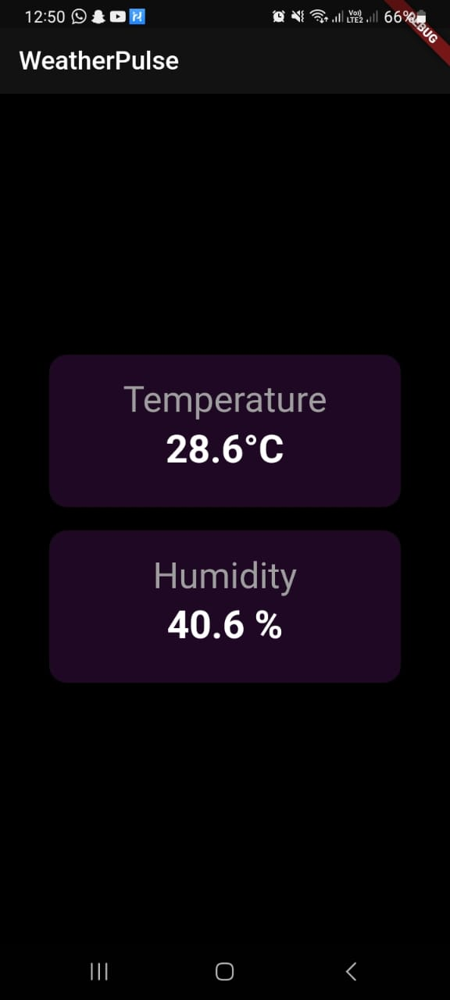

# WeatherPulse: Real-time Weather Monitoring System

WeatherPulse is a comprehensive weather monitoring solution that integrates Flutter, Firebase, and Raspberry Pi to offer real-time temperature and humidity readings. With the power of Adafruit's DHT sensors and the Raspberry Pi, this system provides accurate environmental data directly to your mobile device.





## 📌 Table of Contents

- [Features](#features)
- [Technologies Used](#technologies-used)
- [System Architecture](#system-architecture)
- [Getting Started](#getting-started)
  - [Prerequisites](#prerequisites)
  - [Installation](#installation)
- [Usage](#usage)
- [License](#license)
- [Contact](#contact)

## 🌟 Features

- **Real-time Data**: Fetches temperature and humidity data in real-time from a Raspberry Pi.
- **Intuitive UI**: A user-friendly interface that displays readings in a clear and concise manner.
- **Scalable**: Easily expandable to include more sensors or additional data points.

## 🛠 Technologies Used

- **Flutter**: For crafting an intuitive mobile application.
- **Firebase**: Real-time database to store and retrieve sensor data.
- **Raspberry Pi**: Acts as the sensor hub, collecting data from the DHT22 sensor and sending it to Firebase.

## 📐 System Architecture

The system architecture is straightforward:

1. **Raspberry Pi**: Continuously reads data from the DHT22 sensor.
2. **Firebase**: Acts as a bridge, storing the data from the Raspberry Pi and serving it to the Flutter app.
3. **Flutter App**: Fetches the data from Firebase in real-time and displays it to the user.

## 🚀 Getting Started

### Prerequisites

- Flutter SDK installed on your machine.
- Firebase account and a new project set up.
- Raspberry Pi with the DHT22 sensor connected.
- Adafruit DHT library installed on the Raspberry Pi.

### Installation

1. **Flutter Setup**:
    - Follow the official [Flutter installation guide](https://flutter.dev/docs/get-started/install).
    - Clone this repository: 
      ```bash
      git clone https://github.com/yourusername/WeatherPulse.git
      cd WeatherPulse
      ```

2. **Firebase Configuration**:
    - Navigate to the [Firebase Console](https://console.firebase.google.com/) and set up a new Realtime Database.
    - Integrate Firebase with the Flutter app using the [Firebase Flutter setup guide](https://firebase.flutter.dev/docs/overview).

3. **Raspberry Pi Configuration**:
    - Set up the Raspberry Pi and connect the DHT22 sensor.
    - Install the Adafruit DHT library.
    - Place the `ht.py` script on the Raspberry Pi and ensure it has execute permissions.
    - Run the script to start sending data to Firebase.

## 📱 Usage

Upon launching the WeatherPulse app, it will automatically fetch and display the latest temperature and humidity data. The intuitive UI ensures that users can easily understand and interpret the readings.

## 📜 License

Distributed under the MIT License. See `LICENSE` for more information.

## 📞 Contact

Mustafa Kamal - mustfakmalik@gmail.com
Sarmad Sabir - sarmadsabir7@gmail.com

---
